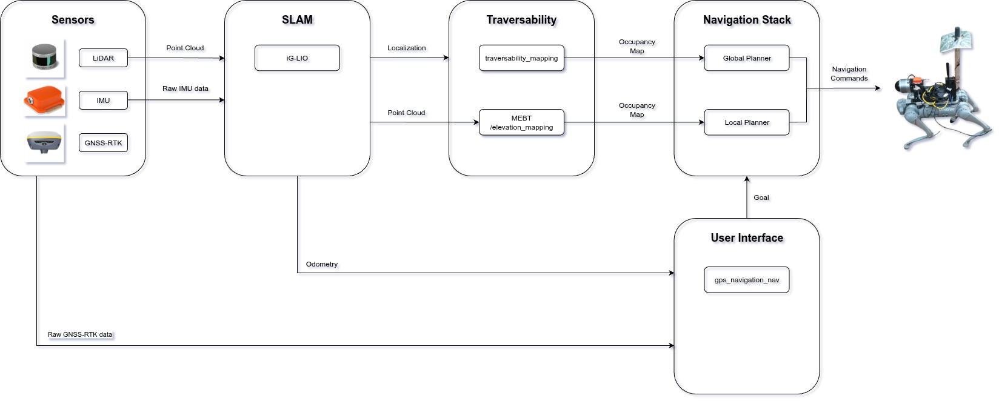

# Autonomous Waypoint Navigation on Unitree Go1 Edu in Irregular Outdoor Terrains

This repository provides a robust pipeline for autonomous waypoint navigation on the Unitree Go1 Edu robot, tailored for irregular outdoor terrains.



## Sumary of the System Architecture

This system is an integrated architecture designed for autonomous robot navigation in complex environments, such as forests. It combines LiDAR and IMU (Inertial Measurement Unit) sensors with advanced mapping, traversability evaluation, and path planning algorithms. Below is a detailed summary of the main components and workflow:

---

#### 1. **SLAM Module (Simultaneous Localization and Mapping)**  
- **Input**: Raw data from LiDAR (3D point cloud) and IMU.
- **Main Algorithm**: iG-LIO (Incremental Generalized LiDAR-Inertial Odometry), a robust and efficient method.
  - Generates precise odometry using sensor fusion.
  - Produces dense and detailed maps but without loop-closure correction.
- **Output**: Robot localization and filtered point cloud, which feed into the next modules.

---

#### 2. **Traversability Evaluation Module**  
This module contains three main algorithms for terrain analysis, each with distinct approaches:

- **traversability_mapping**:
  - Creates a dense elevation map from LiDAR data using Bayesian regression.
  - Classifies each cell in a grid based on characteristics such as step height, slope, and roughness.
  - Determines terrain safety using a probabilistic traversability threshold.

- **MEBT (Mechanical Effort-Based Traversability)**:
  - Evaluates the mechanical effort required for the robot to traverse each terrain cell.
  - Calculates gradients to estimate energy consumption.
  - Considers the alignment between the robot’s direction and the terrain gradient.

- **elevation_mapping**:
  - Generates a probabilistic 2.5D elevation map.
  - Uses a Kalman filter to update height estimates and uncertainty as new data is received.

- **Common Output**: All three algorithms generate an **occupancy map**, which is used by the navigation module.

---

#### 3. **Navigation Module (move_base)**  
- **Input**: Occupancy map generated by the traversability algorithms.
- **Features**:
  - **Global Planner**: Defines a global path from the starting point to the destination. Using the traversability_mapping occupancy map.
  - **Local Planner**: Adjusts the global path in real-time, considering dynamic obstacles and sending velocity commands to the robot. Using the elevation_mapping or the MEBT to generate the occupancy map.
- **Output**: Control commands for robot movement.

---

#### 4. **User Interface**  
- Allows the user to define geographic reference points as navigation goals.
- **Flow**:
  - Geographic points are converted to UTM (Universal Transverse Mercator) coordinates.
  - They are then transformed into the robot’s local coordinate system.
  - Finally, they are sent as goals to the `move_base` module.

---

Below is a step-by-step guide to set up and utilize the system effectively.

---

## First Steps

### 1. Install Docker
Follow the official Docker installation guide for your OS:  
[https://docs.docker.com/desktop/](https://docs.docker.com/desktop/)

**OR** use package managers:  
```bash
# Ubuntu
sudo apt install docker docker-compose

# Fedora
sudo dnf install docker docker-compose
```

### 2. Clone the Repository
#### Install Git
```bash
# Ubuntu
sudo apt install git

# Fedora
sudo dnf install git
```

#### Clone the repo and all the submodules
```bash
git clone --recursive https://github.com/Gostimari/go1_repo.git
```

---

## Docker Setup

1. Enable Docker GUI access:
   ```bash
   xhost +local:root
   ```
2. Navigate to the `docker` directory and start the containers:
   ```bash
   docker-compose up
   # or
   docker compose up
   ```
---


# GUI Application

The GUI application serves as the central interactive interface for managing and controlling the entire system. It provides two versions of the application: one for the **ROS Melodic container** and the other for the **ROS Noetic container**. These applications allow you to launch algorithms, drivers, and ROS-specific commands with ease. Below is a detailed explanation of the two applications and their respective buttons. Every button is associated with a sript inside the `shared forlder`directory. These scrits launch the ROS launch files and some commands to run on the bash shell.

---

## ROS Noetic App

This application is designed for the **ROS Noetic container** and focuses on launching algorithms and managing the robot's navigation system. This app is a bash script in the `shared_folder/app_launcher_noetic.sh`


### Button Descriptions

- **Collect GPS**(`shared_folder/collect_gps.sh`)  
  - Opens a graphical interface centered on the first GPS location received.  
  - Allows you to select **3 geographic goals** for the robot by clicking on the `Publish Pose` button and pressing in the desired location on the map.  
  - After selecting the points, terminate the process by pressing the **Kill** button in each application.  
  

- **MEBT**(`shared_folder/mebt.sh`)  
  - Launches the system using the **Mechanical Effort-Based Traversability (MEBT)** algorithm as the **local planner**.  
  - Requires the **Traversability** and **xsens driver** buttons from the **Melodic App** to be activated.  

- **Elevation**(`shared_folder/elevation.sh`)  
  - Launches the system using the **Elevation Mapping** algorithm as the **local planner**.  
  - Requires the **Traversability** and **xsens driver** buttons from the **Melodic App** to be activated.  

- **Traversability**(`shared_folder/trav.sh`)  
  - Launches the system using the **traversability_mapping** algorithm as the **global planner**.  
  - Requires the **Traversability** and **xsens driver** buttons from the **Melodic App** to be activated.  

- **Startup Drivers**(`shared_folder/startup.sh`)  
  - Starts the drivers for the sensors and the robot.  
  - Automatically triggered when launching any algorithm.  

- **Catkin Build**  
  - Compiles the ROS workspace.  

- **Rqt TF Tree**  
  - Displays the transformations tree of the entire system.  
  - Useful for debugging issues related to transformations.  

- **Custom Command**  
  - Allows you to execute any terminal command within the app without opening a new Docker instance.  
  - Simply press the button and enter the desired command.  

- **Ros Purge**  
  - Clears the ROS cache to prevent potential issues caused by cached data.  
  - Recommended to use frequently.  

- **Rosbag**(`shared_folder/record_bag.sh`)  
  - Automatically records selected topics into a ROS bag file.  
  - The topics to be recorded can be configured in the associated script (`record_bag.sh`).  

- **GoalStatus**(`shared_folder/goal_status.sh`)  
  - Experimental feature to change the goal status of `move_base`.  
  - Sends a `move_base` message with status `3`, indicating that the goal has been reached.  
  - Useful for terminating a goal early or moving to the next one for safety reasons.  

- **Kill**  
  - Terminates all active ROS processes.  
  - Recommended to use this button before switching between algorithms or exiting the Docker container.  

---

## ROS Melodic App

This application is designed for the **ROS Melodic container** and complements the Noetic App by launching algorithms, managing drivers, workspace compilation, and system utilities. This app is a bash script in the `shared_folder/app_launcher_melodic.sh`


### Button Descriptions

- **Traversability**(`shared_folder/trav-melodic.sh`)  
  - Launches the **traversability_mapping** algorithm as the **global planner** for the system.  
  - Works in conjunction with the algorithms launched from the **Noetic App**.  

- **xsens Driver**  
  - Starts the **xsens IMU drivers**, which are required for the IMU functionality in the system.  

- **Catkin Build**  
  - Compiles the ROS workspace.  

- **Custom Command**  
  - Allows you to execute any terminal command within the app without opening a new Docker instance.  
  - Simply press the button and enter the desired command.  

- **Ros Purge**  catkin_ws/src/navigation_final_semfire_pilot/launch/ranger_navigation.launch
  - Clears the ROS cache to prevent potential issues caused by cached data.  
  - Recommended to use frequently.  

- **Kill**  
  - Terminates all active ROS processes.  
  - Recommended to use this button before switching between algorithms or exiting the Docker container.  

---

## Map Server Setup (Docker)
This is created automaticaly with the `docker compose up`, but if you want to run separately here are the instructions:

1. Download map data (e.g., Portugal):
   ```bash
   wget 'https://download.geofabrik.de/europe/portugal-latest.osm.pbf'
   wget 'https://download.geofabrik.de/europe/portugal.poly'
   ```

2. Create Docker volumes and import data:
   ```bash
   docker volume create osm-data
   docker volume create osm-tiles
   docker run -e UPDATES=enabled \
      -v /absolute/path/to/portugal-latest.osm.pbf:/data/region.osm.pbf \
      -v /absolute/path/to/portugal.poly:/data/region.poly \
      -v osm-data:/data/database/ \
      overv/openstreetmap-tile-server import
   ```

3. Start the tile server:
   ```bash
   docker run -p 8080:80 \
      -v osm-data:/data/database/ \
      -v osm-tiles:/data/tiles/ \
      -d overv/openstreetmap-tile-server run
   ```

**Tile URL** (Max Zoom: 19):  
- `http://127.0.0.1:8080/tile/{level}/{x}/{y}.png`

---

## Metrics & Analysis
The system automatically extracts key metrics during operation, which can be used for performance evaluation and analysis. Below is a list of the default metrics collected:

### Default Metrics
```bash
Travelled Distance (m)
Velocity (m/s)
Instability Index -> A metric used to quantify the level of motion irregularity or disturbance experienced by the robot during locomotion, based on IMU data.
Torque (N.m)
Foot Force (N)
Power Draw (A)
Voltage (V)
Elapsed Time (s)
```

The **metrics package** is integrated into the algorithm scripts (`shared_folder/mebt.sh`, `shared_folder/elevation.sh`, `shared_folder/trav.sh`) and is enabled by default. To configure the output directory for the log files (`.csv`), follow these steps:

1. Navigate to the `catkin_ws/src/metrics_extractor/src` directory, where the Python scripts are located.
2. Open the `metrics.py` file and modify line 95 to specify the desired algorithm:
   ```bash
   self.logfiles_path = os.path.join(self.current_path, "logfiles/elev")  # Change between "logfiles/elev" or "logfiles/mebt"
   ```
---

### Run the Metrics Node
To extract metrics during a mission, execute the following command:
```bash
rosrun metrics_extractor metrics.py
```

### Generate Plots and LaTeX Tables
After collecting the metrics, you can generate visualizations and LaTeX-ready tables using the `table_generator.py` script. Follow these steps:

1. Navigate to the `catkin_ws/src/metrics_extractor/src` directory.
2. Run the script:
   ```bash
   python3 table_generator.py
   ```

**Configuration for Specific Algorithms**

To adapt the script for a specific algorithm, update the following lines in `table_generator.py`:

- Change line 112:
  ```bash
  for csv_file in Path('.').glob('../logfiles/elev/logfile_metrics-*.csv'):
  ```
- Change line 202:
  ```bash
  for csv_raw_file in Path('.').glob('../logfiles/elev/logfile_raw-*.csv'):
  ```
- Change line 326:
  ```bash
  with open('../tables/elev/elev_table.tex', 'w') as f:
  ```
- Change line 379:
  ```bash
  plt.savefig('../tables/elev/elev_3d_paths.png', dpi=300, bbox_inches='tight')
  ```
- Change line 426:
  ```bash
  plt.savefig('../tables/elev/elev2_2d_paths.png', dpi=300, bbox_inches='tight', transparent=True, pad_inches=0)
  ```

Replace `elev` with the appropriate folder name for the desired algorithm (`mebt` or `elev`).

---

## System Configuration
To optimize system performance, you can adjust parameters within each algorithm. The default values provided are based on the best results achieved during testing but may need tuning for specific use cases. In the respective launch files, there is a `crop_box` made to the LiDAR scan, to prevent the algorithm considerent the upside of the trees, reducing noise and false detections.

### traversability_mapping
Inside `catkin_ws/src/traversability_mapping/traversability_mapping/include/utility.h` file you can change some parameters to better accomodate you necessities.

- **Sensor and Filtering Thresholds** (Lines 102–103), you can change the thresholds for the sensor range limit, height limit and angle limit to resctrict what do you want the algorithm to consider as obstacle.
```bash
extern const float sensorRangeLimit = 12; // only keep points with in ... 12
extern const float filterHeightLimit = (urbanMapping == true) ? 0.1 : 0.15; // step diff threshold  0.1 : 0.15
extern const float filterAngleLimit = 20; // slope angle threshold
```
- **Obstacle Probability** (Lines 111–112), the probability of considering an obstacle inside the LiDAR FoV (Field of View) and outside:
```bash
extern const float p_occupied_when_laser = 0.9;
extern const float p_occupied_when_no_laser = 0.2;
```
- **PRM Planner**(The 3D global planner used by the system)(Lines 138–142), you can change the lines 138 to 142. You can change how the planner connects the nodes of the visibility graph and if you want to plan unknown map.
```bash
extern const bool planningUnknown = true;
extern const float costmapInflationRadius = 0.2; //0.2 0.8
extern const float neighborSampleRadius = 0.5;
extern const float neighborConnectHeight = 1.0; //1.0
extern const float neighborConnectRadius = 2.0; //2.0 2.5
```

### MEBT
For the MEBT, you have some options on the launch file `catkin_ws/src/navigation_final_semfire_pilot/launch/ranger_navigation.launch` to adapt. The main ones are:

- **Map Resolution** (Line 12), you can change the resolution of the map, this will impact the computational power required by the algorithm:
```bash
<arg name="resolution" default="0.20" />
```

- **Downsampling Resolution** (Line 50), you have an option `leaf_size` determines the resolution of the downsampled point cloud, A larger `leaf_size` results in fewer points but lower resolution, while a smaller `leaf_size` retains more detail but increases the number of points.

- **Gradient Threshold** (Line 126), there is an option to change the `gradient_threshold` for the algorithm, this will impact when the algorithm detects as a obstacle or not.

### elevation_mapping
Inside the `catkin_ws/src/elevation_mapping/elevation_mapping_demos/config/robots/go1.yaml` you can change some aspects to this algorithm, like input sources and resolution that can change the output.

- **Point Cloud Cropping** (Line 21), you can crop the input source point cloud, however this is already done in the launch file `catkin_ws/src/elevation_mapping/elevation_mapping_demos/launch/go1_elevation.launch`.

```bash
sensor_processor/ignore_points_above: 0.85
```

- **Map Resolution** (Lines 25–26), you can change the map resolution you want. This will impact the computational power.

```bash
resolution: 0.15
```

### move_base
The `move_base` configuration includes global and local costmap parameters, as well as planner settings. These files are located in the respective directories:

- **Global Costmap Parameters**: `global_costamp_params.yaml` is the parameters associated with the occupancy map that is received from the traversability_mapping.

- **Local Costmap Parameters**: `local_costamp_params.yaml` is the parameters associated with the local occupancy map or local reactive navigation, using the LiDAR point cloud as a obstacle layer.

- **Planner Parameters**: `move_base.yaml` has the parameters to change the local planner used by the robot, you can ajust the `TrajectoryPlannerROS` to fine tune the robot navigation, increase or decrease the goal tolerance and a lot of other parameters.

  ```bash
  TrajectoryPlannerROS:

    # Robot Configuration
    acc_lim_x: 5
    acc_lim_y: 7
    acc_lim_theta: 12
    max_vel_x: 0.8
    min_vel_x: -0.8
    max_vel_y: 0.8
    min_vel_y: -0.8

    # Goal Tolerance
    yaw_goal_tolerance: 6.2832  # 2π radians
    xy_goal_tolerance: 0.5      # Tolerance in meters

    # Simulation Parameters
    sim_time: 4.0               # Simulation time horizon
    vx_samples: 20              # Samples for velocity in x-direction
    vtheta_samples: 40          # Samples for angular velocity

    # Trajectory Scoring
    occdist_scale: 0.1          # Weight for obstacle avoidance
    pdist_scale: 5              # Weight for path distance
    gdist_scale: 5              # Weight for goal distance

    # Oscillation Prevention
    oscillation_reset_dist: 0.05  # Minimum distance to reset oscillation flags
  ```

---
